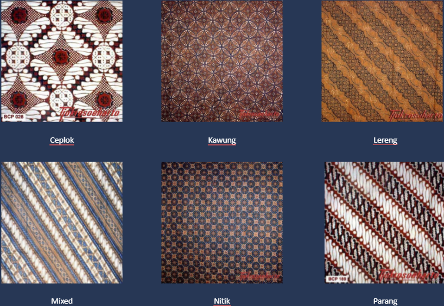
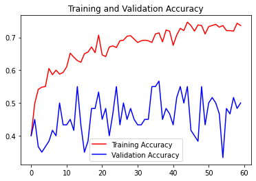

# Machine Learning for Bangkit Capstone
For this Machine Learning side of this project, we're inspired by this Batik pattern recognition [repository](https://github.com/yohanesgultom/deep-learning-batik-classification) by **Machine Learning & Computer Vision (MLCV) Lab, Faculty of Computer Science, Universitas Indonesia**.

## Dataset Overview
This [dataset](https://drive.google.com/file/d/1uFnhO8WXdnyTBxGFy1qlqWU4iPmEF0kH/view) contains 645 (but only 640 can be used) different images of 6 different images, consisting of 6 different classes of batik patterns. Among them are:
1. Ceplok
2. Kawung
3. Lereng
4. Mix
4. Nitik
5. Parang


## Requirements
For this project we don't use a desktop computer, but use Google Colab instead.
* Google Colab (GPU Accelerator)
* Google Drive (Mounted)
* Tensorflow

## Prepare the Dataset
The file structure of our dataset is like this:
```
train_data_dir/
	Ceplok/*.jpg
	Kawung/*.jpg
	Lereng/*.jpg
	Nitik/*.jpg
	Parang/*.jpg

test_data_dir/
	Ceplok/*.jpg
	Kawung/*.jpg
	Lereng/*.jpg
	Nitik/*.jpg
	Parang/*.jpg
```
However, there are some error in our training data that we must delete before training. Among them are:
```
Ceplok/
    Yogya-Tulis-Prabu anom Truntum grompol Riningan-Truntum,Grompol-Sogan.jpg

Parang/
    KP042.jpg
    KP044.jpg
    Kudus-Parang-Parang,Flora-Non Sogan (1).jpg
    Kudus-Parang-Parang,Flora-Non Sogan (2).jpg
```
## Data Preprocessing and Modelling
Before we train the dataset, it is good for us to do some augmentation, because our dataset is quite small. The data augmentation we use are:
* Dataset normalisation
* Rotation (We refer to this [paper](https://jiki.cs.ui.ac.id/index.php/jiki/article/view/507))


We use [ResNet-50v2](https://keras.io/api/applications/resnet/#resnet50v2-function) architecture and use transfer learning method to get our model better. You can refer to this [medium](https://towardsdatascience.com/transfer-learning-for-image-classification-using-tensorflow-71c359b56673) to learn about it.

## The Result
The best results we got were the following:



We got $73.6\%$ for the accuracy and $50\%$ for the validation accuracy.